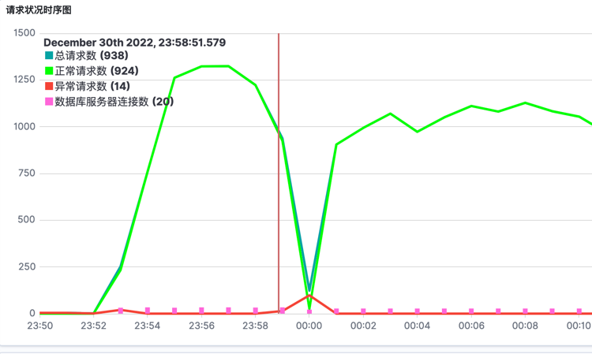

# 说明

[Kibana画图绘制指引](https://www.elastic.co/guide/cn/kibana/current/xy-chart.html)

## 读

```bash
curl http://localhost:8080/report/product/top10
```

## 写

```bash
curl  http://localhost:8080/uba/datagen\?size\=300\

curl http://localhost:8080/uba/datagen\?size\=1

大批量请求
ab -n 500 -c 5 http://localhost:8080/uba/datagen\?size\=1
```

## 请求效果


## DevTools测试

```bash
PUT my_index
{
  "mappings": {
    "properties": {
      "date": {
        "type": "date" 
      }
    }
  }
}

DELETE http-logs-1

PUT my_index/_doc/1
{ "date": "2015-01-01" } 

PUT my_index/_doc/2
{ "date": "2015-01-01T12:10:30Z" } 

PUT my_index/_doc/3
{ "date": 1420070400001 } 

GET my_index/_search
{
  "sort": { "date": "asc"} 
}

GET http-logs-2/_search 
{
  "sort": { "timestamp": "asc"} 
}


PUT http-logs-2
{
  "mappings": {
    "properties": {
      "timestamp": {
        "type": "date" 
      }
    }
  }
}


PUT ip-parse-java
{
  "mappings": {
    "properties": {
      "timestamp": {
        "type": "date" 
      }
    }
  }
}

PUT db-info
{
  "mappings": {
    "properties": {
      "timestamp": {
        "type": "date" 
      }
    }
  }
}
```

## 观察

URL

http://localhost:5601/app/dashboards#/view/fd00b980-8814-11ed-87ff-fd23a312ba6c?_g=(filters:!(),query:(language:kuery,query:''),refreshInterval:(pause:!t,value:0),time:(from:now-30m,to:now))&_a=(description:'',filters:!(),fullScreenMode:!f,options:(hidePanelTitles:!f,useMargins:!t),query:(language:kuery,query:''),tags:!(),timeRestore:!f,title:UpgradeMonitor,viewMode:view)

```bash


```

### kibana绘图

```bash
.es(index=http-logs-*,timefield=timestamp,metric=count).label("总请求数"),
.es(index=http-logs-*,timefield=timestamp,metric=count,q=response.status:200).label(正常请求数),
.es(index=http-logs-*,timefield=timestamp,metric=count,q=response.status:>200).bars(stack=false).color(#F44336).label(异常请求数)

```

Timelion 2:

```bash
.es(index=http-logs-*,timefield=timestamp,metric=count).label("总请求数"),
.es(index=http-logs-*,timefield=timestamp,metric=count,q=response.status:200).label(正常请求数).legend().color(#00FF00),
.es(index=http-logs-*,timefield=timestamp,metric=count,q=response.status:>200&request.uri:"http://localhost:8080/report/product/top10").color(#F44336).label(异常请求数)
.es(index=db-info,timefield=timestamp,metric=max:threadCounts).color(#F44336).label(数据库服务器请求数)
,

```

### 请求耗时的Timelion

```bash
#耗时
.es(index=http-logs-*,timefield=timestamp,metric=max:timeTaken,q=response.status:200).label(最高请求耗时),
.es(index=http-logs-*,timefield=timestamp,metric=min:timeTaken,q=response.status:200).label(最低请求耗时),
.es(index=http-logs-*,timefield=timestamp,metric=avg:timeTaken,q=response.status:200).label(平均请求耗时)

```

### 错误率 Timelion

```bash
#耗时
.es(index=http-logs-*,timefield=timestamp,metric=max:timeTaken,q=response.status:200).label(最高请求耗时),
.es(index=http-logs-*,timefield=timestamp,metric=min:timeTaken,q=response.status:200).label(最低请求耗时),
.es(index=http-logs-*,timefield=timestamp,metric=avg:timeTaken,q=response.status:200).label(平均请求耗时),


```


PostgreSQL RDS 10 reboot和failover的时候的切换图
![]

## 常用命令

```bash

select count(*) from user_behavior;
select count(product_id), product_id from user_behavior group by product_id order by  count(product_id) desc;

#postgresql
psql -h for-upgrade-test.cypjqpec31mg.ap-southeast-1.rds.amazonaws.com -p 5432 -U postgres runoobdb
```

## 结论

HikariCP各参数配置说明: https://github.com/brettwooldridge/HikariCP

> Java程序侧需要30s左右识别新的DNS IP变更


> 应用程序无法自行恢复，新的请求一直会进不来


## 优化

### 第一部分， 应用侧优化，调节连接池信息，

> 主要是一些超时时间的合理设定. 设定后程序不可用时间恢复为分钟级别， 具体可以参考下图。

```yaml
spring:
  datasource:
    url: jdbc:postgresql://for-upgrade-test.xxxxxx.ap-southeast-1.rds.amazonaws.com:5432/cutestore
    username: postgres
    password: xxxxxx
    driver-class-name: org.postgresql.Driver
    hikari:
      maximum-pool-size: 20
      minimum-idle: 3
      max-lifetime: 30000
      connection-timeout: 3000 # 3s内必须能够拿到链接， 否则跑错 VPC内可以指定更短
      idle-timeout: 60000 # 空余连接保存 一分钟
      validation-timeout: 1000 # 1s内必须能够返回

```



从正常进入不可用到恢复正常，整体大约在1分钟左右

### 第二部分， 应用侧优化，禁用DNS缓存

[禁用Java DNS Cache](https://docs.aws.amazon.com/neptune/latest/userguide/best-practices-gremlin-java-disable-dns-caching.html)

> java.security.Security.setProperty("networkaddress.cache.ttl", "0");需要放在整个程序的第一行

```java
public class CutestoreApplication implements ApplicationRunner {

    public static void main(String[] args) {
        //禁用本地DNS缓存
        java.security.Security.setProperty("networkaddress.cache.ttl", "0");
        SpringApplication.run(CutestoreApplication.class, args);
    }
}
```

## 各种错误

---

1. org.postgresql.util.PSQLException: 尝试连线已失败。

---

2. java.sql.SQLTransientConnectionException: HikariPool-1 - Connection is not available, request timed out after
   30006ms. at com.zaxxer.hikari.pool.HikariPool.createTimeoutException(HikariPool.java:696) ~[HikariCP-4.0.3.jar:na]
   at com.zaxxer.hikari.pool.HikariPool.getConnection(HikariPool.java:197) ~[HikariCP-4.0.3.jar:na]
   at com.zaxxer.hikari.pool.HikariPool.getConnection(HikariPool.java:162) ~[HikariCP-4.0.3.jar:na]

---

3. org.postgresql.util.PSQLException: An I/O error occurred while sending to the backend. at
   org.postgresql.core.v3.QueryExecutorImpl.execute(QueryExecutorImpl.java:382) ~[postgresql-42.3.8.jar:42.3.8]
   at org.postgresql.jdbc.PgStatement.executeInternal(PgStatement.java:490) ~[postgresql-42.3.8.jar:42.3.8]


---
4.
java.net.SocketTimeoutException: connect timed out
at java.base/java.net.PlainSocketImpl.socketConnect(Native Method) ~[na:na]
at java.base/java.net.AbstractPlainSocketImpl.doConnect(AbstractPlainSocketImpl.java:412) ~[na:na]
at java.base/java.net.AbstractPlainSocketImpl.connectToAddress(AbstractPlainSocketImpl.java:255) ~[na:na]
at java.base/java.net.AbstractPlainSocketImpl.connect(AbstractPlainSocketImpl.java:237) ~[na:na]
at java.base/java.net.SocksSocketImpl.connect(SocksSocketImpl.java:392) ~[na:na]
at java.base/java.net.Socket.connect(Socket.java:608) ~[na:na]
at org.postgresql.core.PGStream.createSocket(PGStream.java:241) ~[postgresql-42.3.8.jar:42.3.8]
at org.postgresql.core.PGStream.<init>(PGStream.java:98) ~[postgresql-42.3.8.jar:42.3.8]
at org.postgresql.core.v3.ConnectionFactoryImpl.tryConnect(ConnectionFactoryImpl.java:109) ~[postgresql-42.3.8.jar:42.3.8]
at org.postgresql.core.v3.ConnectionFactoryImpl.openConnectionImpl(ConnectionFactoryImpl.java:235) ~[postgresql-42.3.8.jar:42.3.8]
at org.postgresql.core.ConnectionFactory.openConnection(ConnectionFactory.java:49) ~[postgresql-42.3.8.jar:42.3.8]
at org.postgresql.jdbc.PgConnection.<init>(PgConnection.java:223) ~[postgresql-42.3.8.jar:42.3.8]
at org.postgresql.Driver.makeConnection(Driver.java:402) ~[postgresql-42.3.8.jar:42.3.8]
at org.postgresql.Driver.connect(Driver.java:261) ~[postgresql-42.3.8.jar:42.3.8]
at com.zaxxer.hikari.util.DriverDataSource.getConnection(DriverDataSource.java:138) ~[HikariCP-4.0.3.jar:na]
at com.zaxxer.hikari.pool.PoolBase.newConnection(PoolBase.java:364) ~[HikariCP-4.0.3.jar:na]
at com.zaxxer.hikari.pool.PoolBase.newPoolEntry(PoolBase.java:206) ~[HikariCP-4.0.3.jar:na]
at com.zaxxer.hikari.pool.HikariPool.createPoolEntry(HikariPool.java:476) ~[HikariCP-4.0.3.jar:na]
at com.zaxxer.hikari.pool.HikariPool.access$100(HikariPool.java:71) ~[HikariCP-4.0.3.jar:na]
at com.zaxxer.hikari.pool.HikariPool$PoolEntryCreator.call(HikariPool.java:726) ~[HikariCP-4.0.3.jar:na]
at com.zaxxer.hikari.pool.HikariPool$PoolEntryCreator.call(HikariPool.java:712) ~[HikariCP-4.0.3.jar:na]
at java.base/java.util.concurrent.FutureTask.run(FutureTask.java:264) ~[na:na]
at java.base/java.util.concurrent.ThreadPoolExecutor.runWorker(ThreadPoolExecutor.java:1128) ~[na:na]
at java.base/java.util.concurrent.ThreadPoolExecutor$Worker.run(ThreadPoolExecutor.java:628) ~[na:na]
at java.base/java.lang.Thread.run(Thread.java:834) ~[na:na]